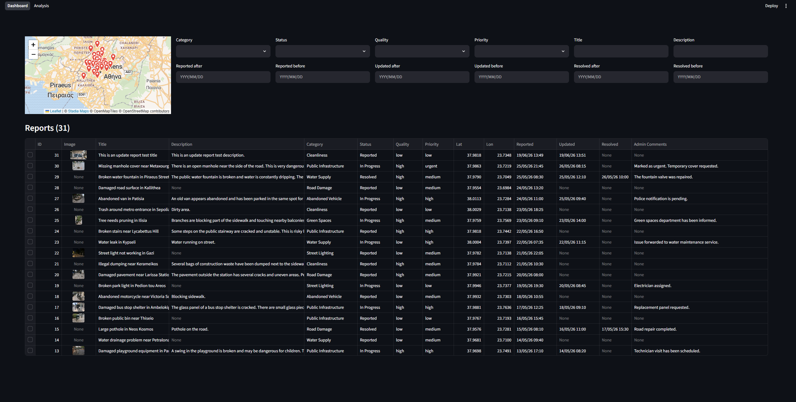
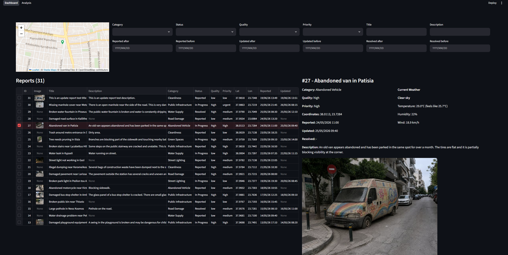
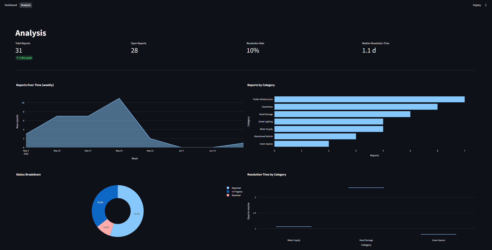
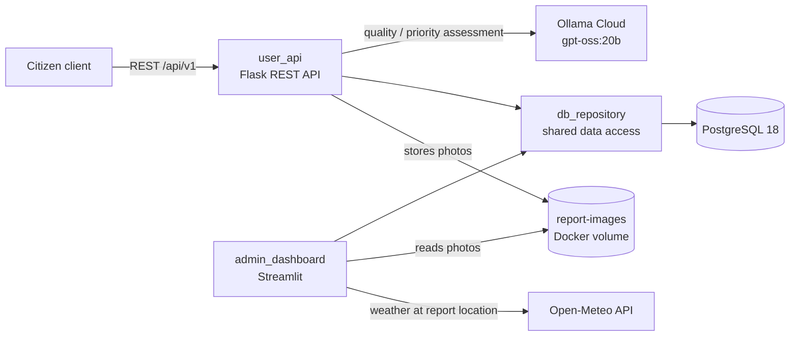

# City Report

A municipal issue-reporting platform: a REST API for citizens, an LLM triage step,
and a Streamlit operations dashboard for city staff.

## What it does

Citizens file reports about problems in the city — a pothole, a broken street
light, an abandoned vehicle — through a REST API, attaching a title, description,
category, GPS coordinates and a photo. Each incoming report is passed to an LLM
that reads it and assigns two triage bands: a **quality** score for how usable the
report is, and a **priority** for how urgently it needs attention. City staff then
work the queue from an admin dashboard, where reports appear on a map of the city
and in a filterable table: they can open any report to see its photo, its AI
assessment and the current weather at its location, then change its status and
leave notes for the department handling it. A second dashboard page tracks how the
backlog is moving — volume over time, breakdown by category and status, and how
long each category takes to resolve.

## Screenshots


*The reports dashboard: city-wide map, filters across every report field, and the full report queue.*


*Opening a report shows its photo, the LLM-assigned quality and priority, and live weather at the reported coordinates.*


*The analysis page: headline metrics plus volume, category, status and resolution-time charts.*

## Features

- **REST API** — 8 endpoints covering report creation, retrieval, partial updates,
  image serving, and a list endpoint with 14 filter and sort parameters.
- **AI triage** — every created or updated report is assessed by `gpt-oss:20b` on
  Ollama Cloud, which returns a quality and priority band. Unparseable or failed
  responses fall back to safe defaults, so the API never fails on the LLM's account.
- **Interactive map** — Leaflet map of all reports, re-centred on the selected one.
- **Weather context** — current conditions at a report's coordinates, from Open-Meteo.
- **Analytics** — Plotly charts for report volume over time, category and status
  breakdowns, and resolution time per category.
- **Seeded demo data** — 30 realistic reports across 8 categories and 4 statuses,
  with photos, loaded on first start, so the app is worth looking at immediately.
- **Fully containerised** — database, API and dashboard come up with one command.

## Architecture



`db_repository` is a shared package that both services import: all SQL lives there,
so the API and the dashboard never talk to PostgreSQL directly. Report photos are
written by the API to a Docker volume that the dashboard reads them back from.

## Tech stack

Python 3.14 · Flask · Streamlit · PostgreSQL 18 · psycopg 3 · pandas · Plotly ·
Leaflet · Open-Meteo · Ollama Cloud · Docker Compose

## API

| Method | Path | Purpose |
| --- | --- | --- |
| GET | `/api/v1/healthcheck` | Liveness probe |
| GET | `/api/v1/categories` | List report categories |
| GET | `/api/v1/statuses` | List report statuses |
| POST | `/api/v1/reports` | Create a report |
| GET | `/api/v1/reports` | List, filter and sort reports |
| GET | `/api/v1/report/<ticket_id>` | Fetch a single report |
| PATCH | `/api/v1/report/<ticket_id>` | Update a report |
| GET | `/api/v1/report-images/<ticket_id>` | Serve a report's image |


## Prerequisites

- Docker and Docker Compose
- An Ollama Cloud API key (https://ollama.com) for the AI assessment subsystem

## Configuration

All commands are run from the `code/` directory, where `compose.yaml` lives.

1. Create the environment file from the example and fill in the values:

   ```bash
   cd code
   cp example.env .env
   ```

2. Edit `.env`:

   ```
   POSTGRES_DB=postgres
   POSTGRES_USER=postgres
   POSTGRES_PASSWORD=<choose-a-password>
   OLLAMA_API_KEY=<your-ollama-cloud-api-key>
   ```

## Running the app

From the `code/` directory:

```bash
docker compose up --build -d
```

Then open:

- **Admin dashboard:** http://localhost:8501
- **REST API:** http://localhost:5000 (e.g. http://localhost:5000/api/v1/healthcheck)

To stop the services:

```bash
docker compose down
```

To stop **and wipe the database and images** (start from scratch on the next
`up`, re-running the seed script):

```bash
docker compose down -v
```

## Running the tests

The suite covers the API's request validation. It stubs the database lookups, so
it needs no running services — only Python 3.12 or newer. From the `code/`
directory:

```bash
python -m venv .venv
source .venv/Scripts/activate
pip install -r requirements-dev.txt
pytest
```

On Linux and macOS the activate step is `source .venv/bin/activate`.
